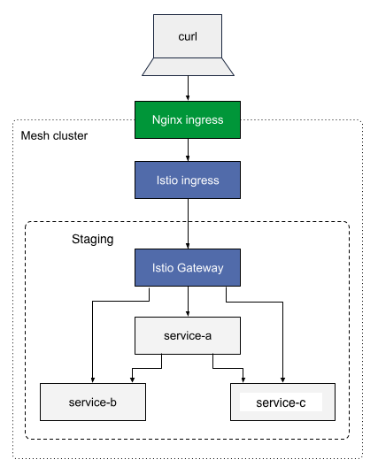

# Sample for Divert with Istio
This repo is a sample about using divert with istio.
The following diagram explains the architectture of the application we will be using in this sample:



### Cluster Admin tasks

The admin of the cluster must run the following commands to install Istio in the Okteto cluster:

```
helm install --namespace istio-system --create-namespace istio-base istio/base --version 1.13.8 --wait
helm install --namespace istio-system istiod istio/istiod --values istio/istiod-helm-values.yaml --version 1.13.8 --wait
kubectl create namespace istio-ingress
kubectl label namespace istio-ingress istio-injection=enabled
helm install --namespace istio-ingress istio-ingress istio/gateway --values istio/istio-ingress-helm-values.yaml --version 1.13.8 --wait
```

Replace `<<okteto-subdomain>>` in `istio-ingress-config.yaml` by the `subdomain` field in your okteto Helm values file:

```
kubectl apply -n istio-ingress -f istio/istio-ingress-config.yaml
```

### Develop tasks

Each developer must run the following commands to deploy their dev environment

### Configure Okteto CLI and kubectl credentials

```
okteto ctx use https://okteto.<<okteto-subdomain>>
okteto kubeconfig
```

### Deploy services in staging

Then, run `okteto -n staging deploy -f okteto-staging.yml --var OKTETO_SUBDOMAIN=<<your-okteto-subdomain>>` to deploy the application in the `staging` namespace.

### Test services

```
curl -k https://service-a-staging.<<okteto-subdomain>>/
curl -k https://service-b-staging.<<okteto-subdomain>>/
curl -k https://service-c-staging.<<okteto-subdomain>>/
curl -k https://service-a-staging.<<okteto-subdomain>>/call-b
curl -k https://service-a-staging.<<okteto-subdomain>>/call-c
```

### Divert service-b in your personal namespace

Run `okteto deploy --var OKTETO_SUBDOMAIN=<<your-okteto-subdomain>>`.

### Test services

```
curl -k https://service-a-<<your-namespace>>.<<okteto-subdomain>>/
curl -k https://service-b-<<your-namespace>>.<<okteto-subdomain>>/
curl -k https://service-c-<<your-namespace>>.<<okteto-subdomain>>/
curl -k https://service-a-<<your-namespace>>.<<okteto-subdomain>>/call-b
curl -k https://service-a-<<your-namespace>>.<<okteto-subdomain>>/call-c
curl -k https://service-a-staging.<<okteto-subdomain>>/call-b
curl -k https://service-a-staging.<<okteto-subdomain>>/call-c
```
